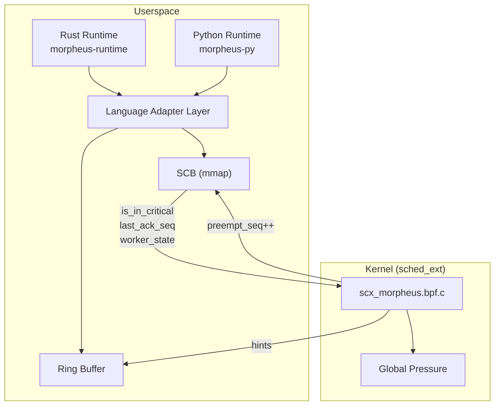
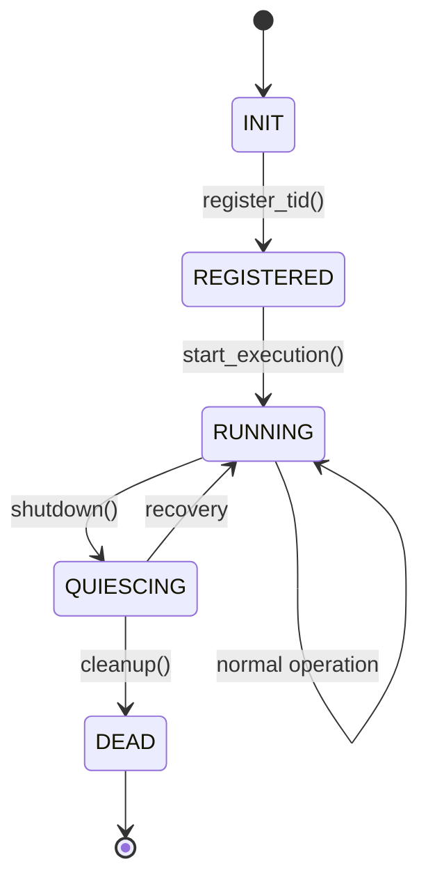
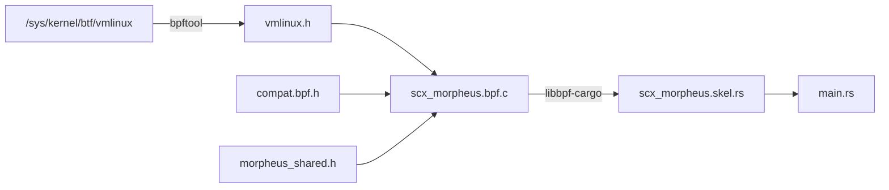

# Morpheus-Hybrid Architecture

**Kernel-Guided Cooperative Async Runtime with Opt-In Escalation**

## Overview

Morpheus-Hybrid is a Linux-only async runtime where the kernel *requests* yields using sched_ext signals, the runtime *chooses* safe yield points, and the kernel may *recover liveness* only on threads that have explicitly opted in to interruption.



## Design Invariants

1. **No forced preemption inside unsafe regions**
2. **Kernel never interrupts a thread unless runtime opted in**
3. **No kernel patches required** (uses sched_ext, Linux 6.12+)
4. **Deterministic behavior in absence of kernel pressure**
5. **Escalation is failure recovery, not scheduling policy**

---

## Architectural Components

### Scheduler Mode (Observer vs Enforcer)

The scheduler operates in one of two modes:

| Mode | Description |
|------|-------------|
| `OBSERVER_ONLY` | Collect data, emit hints, **no enforcement** (default) |
| `ENFORCED` | Full escalation + CPU kicks when workers ignore hints |

Observer mode is the safest choice for production. Enforced mode requires explicit operator opt-in.

### Worker Lifecycle State Machine



| State | Hints Allowed? | Escalation Allowed? |
|-------|----------------|---------------------|
| INIT | ❌ | ❌ |
| REGISTERED | ❌ | ❌ |
| RUNNING | ✅ | ✅ |
| QUIESCING | ❌ | ❌ |
| DEAD | ❌ | ❌ |

### Escalation Policies

| Policy | Action |
|--------|--------|
| `NONE` | Observer mode - hints only |
| `THREAD_KICK` | `scx_bpf_kick_cpu()` to force reschedule |
| `CGROUP_THROTTLE` | Apply cgroup bandwidth throttling |
| `HYBRID` | Kick + throttle (most aggressive) |

### Runtime Determinism Modes

| Mode | Condition | Behavior |
|------|-----------|----------|
| `DETERMINISTIC` | No kernel hints | Fully deterministic execution |
| `PRESSURED` | Hints received | Cooperative scheduling active |
| `DEFENSIVE` | Hint loss detected | Eager voluntary yielding |

---

## Build System

### BPF Compilation



### Header Dependencies

| Header | Purpose |
|--------|---------|
| `vmlinux.h` | Kernel types from BTF |
| `compat.bpf.h` | sched_ext macros |
| `morpheus_shared.h` | Shared types + enums |

---

## Communication Model

### Shared Control Block (SCB)

```
┌─────────────────────────────────────────────────────────────┐
│ Cache Line 1 (Kernel → Runtime)                             │
├─────────────────────────────────────────────────────────────┤
│ preempt_seq (u64)        - Kernel increments to request yield│
│ budget_remaining_ns (u64)- Remaining time budget (advisory) │
│ kernel_pressure_level    - 0-100 pressure indicator         │
│ worker_state             - Lifecycle state (enum)           │
├─────────────────────────────────────────────────────────────┤
│ Cache Line 2 (Runtime → Kernel)                             │
├─────────────────────────────────────────────────────────────┤
│ is_in_critical_section   - 1 if in critical section         │
│ escapable                - 1 if hard preemption allowed     │
│ last_ack_seq             - Last acknowledged preempt_seq    │
│ runtime_priority         - Advisory priority 0-1000         │
│ last_yield_reason        - Why worker last yielded (enum)   │
│ escalation_policy        - Worker's escalation policy       │
└─────────────────────────────────────────────────────────────┘
```

### Global Pressure Aggregator

System-wide pressure signals for voluntary yield eagerness:

```c
struct morpheus_global_pressure {
    __u32 cpu_pressure_pct;     // CPU pressure 0-100 (PSI-derived)
    __u32 io_pressure_pct;      // I/O pressure 0-100
    __u32 memory_pressure_pct;  // Memory pressure 0-100
    __u32 runqueue_depth;       // Aggregate runqueue depth
};
```

---

## Escalation Logic

```c
// Escalation requires ALL conditions:
if (scheduler_mode == ENFORCED &&       // Delta #1
    worker_state == RUNNING &&          // Delta #2
    escalation_policy != NONE &&        // Delta #3
    escapable &&
    !is_in_critical_section &&
    last_ack_seq < preempt_seq &&
    runtime > slice + grace_period) {
    execute_escalation(policy);         // Delta #3
}
```

---

## Language Adapter Layer

```rust
pub trait LanguageAdapter {
    fn enter_safe_point(&self);
    fn enter_checkpoint(&self) -> bool;
    fn enter_critical(&self) -> CriticalGuard;
    fn yield_worker(&self);
    fn default_escapable(&self) -> bool;
}
```

| Language | `default_escapable` | Reason |
|----------|---------------------|--------|
| Rust | `true` | Safe to preempt outside critical sections |
| Python | `false` | GIL safety requires cooperative scheduling |

---

## File Structure

```
Morpheus/
├── Cargo.toml                # Workspace configuration
├── README.md                 # Project overview
├── ARCHITECTURE.md           # This file
├── NON_GOALS.md              # Architectural guardrails
├── benchmark.md              # Performance data
│
├── morpheus-common/          # Shared types + enums
│   ├── include/
│   │   └── morpheus_shared.h # C header (enums, SCB, hints)
│   └── src/lib.rs            # Rust definitions
│
├── scx_morpheus/             # BPF scheduler
│   ├── build.rs              # BTF vmlinux.h generation
│   └── src/bpf/
│       ├── scx_morpheus.bpf.c   # BPF program
│       └── compat.bpf.h         # sched_ext macros
│
├── morpheus-runtime/         # Rust runtime
│   └── src/
│       ├── lib.rs            # Public API
│       ├── adapter.rs        # Language adapter trait
│       ├── scb.rs            # SCB management
│       ├── critical.rs       # Critical sections
│       └── worker.rs         # Worker threads
│
├── morpheus-py/              # Python bindings
│
└── morpheus-bench/           # Benchmarks
```

---

## Non-Goals (Guardrails)

See [NON_GOALS.md](NON_GOALS.md) for details:

1. **Per-task kernel scheduling** - Kernel operates on worker threads only
2. **Bytecode-level preemption** - Safe points are language-runtime controlled
3. **Kernel-managed budgets** - Budgets are advisory, not enforced

---

## Requirements

### Kernel
- Linux 6.12+ with `CONFIG_SCHED_CLASS_EXT=y`
- `CONFIG_DEBUG_INFO_BTF=y`

### Build
```bash
sudo apt install -y pkg-config libelf-dev clang llvm \
    linux-headers-$(uname -r) libbpf-dev bpftool
```

---

## License

SPDX-License-Identifier: GPL-2.0-only
