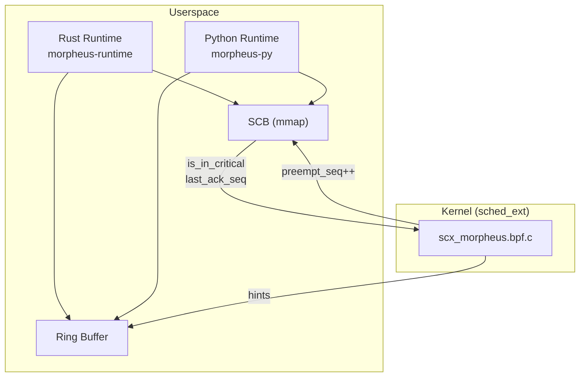

# Morpheus-Hybrid Architecture

**Kernel-Guided Cooperative Async Runtime with Opt-In Escalation**

## Overview

Morpheus-Hybrid is a Linux-only async runtime where the kernel *requests* yields using sched_ext signals, the runtime *chooses* safe yield points, and the kernel may *recover liveness* only on threads that have explicitly opted in to interruption.



## Design Invariants

1. **No forced preemption inside unsafe regions**
2. **Kernel never interrupts a thread unless runtime opted in**
3. **No kernel patches required** (uses sched_ext, Linux 6.12+)
4. **Deterministic behavior in absence of kernel pressure**
5. **Escalation is failure recovery, not scheduling policy**

## Communication Model

### Shared Control Block (SCB)

One SCB per worker thread, stored in `BPF_MAP_TYPE_ARRAY` with `BPF_F_MMAPABLE`.

```
┌─────────────────────────────────────────────────────────────┐
│ Cache Line 1 (Kernel → Runtime)                             │
├─────────────────────────────────────────────────────────────┤
│ preempt_seq (u64)      - Kernel increments to request yield │
│ budget_remaining_ns    - Remaining time budget              │
│ kernel_pressure_level  - 0-100 pressure indicator           │
├─────────────────────────────────────────────────────────────┤
│ Cache Line 2 (Runtime → Kernel)                             │
├─────────────────────────────────────────────────────────────┤
│ is_in_critical_section - 1 if in critical section           │
│ escapable              - 1 if hard preemption allowed       │
│ last_ack_seq           - Last acknowledged preempt_seq      │
│ runtime_priority       - Advisory priority 0-1000           │
└─────────────────────────────────────────────────────────────┘
```

### Ring Buffer (Hints)

Edge-triggered events via `BPF_MAP_TYPE_RINGBUF`:
- Budget exceeded
- Sustained pressure
- Runqueue imbalance

## Escalation Logic

Escalation (forced preemption) requires ALL conditions:

```c
if (escapable &&
    !is_in_critical_section &&
    last_ack_seq < preempt_seq &&
    runtime > slice + grace_period) {
    scx_bpf_kick_cpu(cpu, SCX_KICK_PREEMPT);
}
```

## Language Support

### Rust

```rust
// Checkpoint in CPU-heavy code
morpheus::checkpoint!();

// Protect critical regions
let _guard = morpheus::critical_section();
```

Default: `escapable = true`

### Python

```python
# Checkpoint in CPU-heavy code
morpheus.checkpoint()

# Protect critical regions
with morpheus.critical():
    pass
```

Default: `escapable = false` (GIL safety)

## File Structure

```
Morpheus/
├── morpheus-common/          # Shared types (SCB, hints)
│   ├── include/
│   │   └── morpheus_shared.h
│   └── src/lib.rs
├── scx_morpheus/             # BPF scheduler
│   ├── src/bpf/
│   │   └── scx_morpheus.bpf.c
│   └── src/main.rs           # Loader
├── morpheus-runtime/         # Rust runtime
│   └── src/
│       ├── lib.rs
│       ├── scb.rs
│       ├── critical.rs
│       ├── executor.rs
│       └── worker.rs
├── morpheus-py/              # Python bindings
│   └── src/lib.rs
└── morpheus-bench/           # Benchmarks
    └── src/bin/
        ├── starvation.rs
        ├── liar.rs
        └── latency.rs
```
