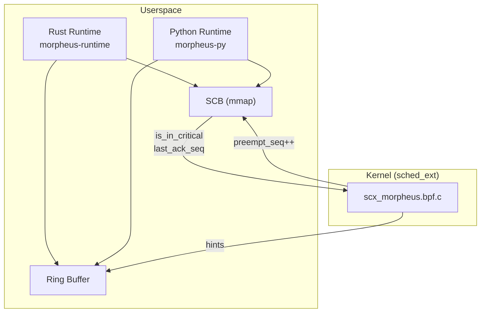
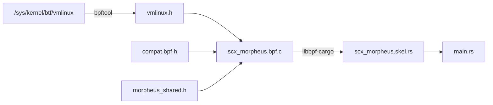

# Morpheus-Hybrid Architecture

**Kernel-Guided Cooperative Async Runtime with Opt-In Escalation**

## Overview

Morpheus-Hybrid is a Linux-only async runtime where the kernel *requests* yields using sched_ext signals, the runtime *chooses* safe yield points, and the kernel may *recover liveness* only on threads that have explicitly opted in to interruption.



## Design Invariants

1. **No forced preemption inside unsafe regions**
2. **Kernel never interrupts a thread unless runtime opted in**
3. **No kernel patches required** (uses sched_ext, Linux 6.12+)
4. **Deterministic behavior in absence of kernel pressure**
5. **Escalation is failure recovery, not scheduling policy**

---

## Build System

### BPF Compilation

The BPF scheduler uses a two-phase compilation:

1. **vmlinux.h Generation** - `build.rs` generates `vmlinux.h` from kernel BTF at build time:
   ```bash
   bpftool btf dump file /sys/kernel/btf/vmlinux format c
   ```

2. **BPF Compilation** - `libbpf-cargo` compiles the BPF C code with:
   - Generated `vmlinux.h` (kernel types)
   - `compat.bpf.h` (sched_ext macros)
   - `morpheus_shared.h` (shared types)



### Header Dependencies

| Header | Purpose |
|--------|---------|
| `vmlinux.h` | Kernel types from BTF (task_struct, sched_ext_ops, kfuncs) |
| `compat.bpf.h` | sched_ext macros (BPF_STRUCT_OPS, SCX_OPS_DEFINE, UEI_*) |
| `morpheus_shared.h` | Shared types (morpheus_scb, morpheus_hint) |

---

## Communication Model

### Shared Control Block (SCB)

One SCB per worker thread, stored in `BPF_MAP_TYPE_ARRAY` with `BPF_F_MMAPABLE`.

```
┌─────────────────────────────────────────────────────────────┐
│ Cache Line 1 (Kernel → Runtime)                             │
├─────────────────────────────────────────────────────────────┤
│ preempt_seq (u64)      - Kernel increments to request yield │
│ budget_remaining_ns    - Remaining time budget              │
│ kernel_pressure_level  - 0-100 pressure indicator           │
├─────────────────────────────────────────────────────────────┤
│ Cache Line 2 (Runtime → Kernel)                             │
├─────────────────────────────────────────────────────────────┤
│ is_in_critical_section - 1 if in critical section           │
│ escapable              - 1 if hard preemption allowed       │
│ last_ack_seq           - Last acknowledged preempt_seq      │
│ runtime_priority       - Advisory priority 0-1000           │
└─────────────────────────────────────────────────────────────┘
```

### Ring Buffer (Hints)

Edge-triggered events via `BPF_MAP_TYPE_RINGBUF`:
- Budget exceeded
- Sustained pressure
- Runqueue imbalance

---

## Escalation Logic

Escalation (forced preemption) requires ALL conditions:

```c
if (escapable &&
    !is_in_critical_section &&
    last_ack_seq < preempt_seq &&
    runtime > slice + grace_period) {
    scx_bpf_kick_cpu(cpu, SCX_KICK_PREEMPT);
}
```

---

## Language Support

### Rust

```rust
// Checkpoint in CPU-heavy code
morpheus::checkpoint!();

// Protect critical regions
let _guard = morpheus::critical_section();
```

Default: `escapable = true`

### Python

```python
# Checkpoint in CPU-heavy code
morpheus.checkpoint()

# Protect critical regions
with morpheus.critical():
    pass
```

Default: `escapable = false` (GIL safety)

---

## File Structure

```
Morpheus/
├── Cargo.toml                # Workspace configuration
├── Cargo.lock                # Pinned dependencies
├── README.md                 # Project overview
├── ARCHITECTURE.md           # This file
├── benchmark.md              # Performance data
│
├── morpheus-common/          # Shared types (SCB, hints)
│   ├── Cargo.toml
│   ├── include/
│   │   └── morpheus_shared.h # C header for BPF/userspace
│   └── src/lib.rs            # Rust definitions
│
├── scx_morpheus/             # BPF scheduler
│   ├── Cargo.toml
│   ├── build.rs              # BTF vmlinux.h generation
│   ├── src/
│   │   ├── main.rs           # Scheduler loader
│   │   └── bpf/
│   │       ├── scx_morpheus.bpf.c   # BPF program
│   │       └── compat.bpf.h         # sched_ext macros
│
├── morpheus-runtime/         # Rust runtime
│   ├── Cargo.toml
│   └── src/
│       ├── lib.rs            # Public API
│       ├── scb.rs            # SCB management
│       ├── critical.rs       # Critical sections
│       ├── executor.rs       # Async executor
│       ├── ringbuf.rs        # Hint consumption
│       ├── runtime.rs        # Runtime builder
│       └── worker.rs         # Worker threads
│
├── morpheus-py/              # Python bindings
│   ├── Cargo.toml
│   ├── pyproject.toml
│   └── src/lib.rs
│
└── morpheus-bench/           # Benchmarks
    ├── Cargo.toml
    ├── benches/
    │   └── checkpoint.rs     # Criterion microbenchmarks
    └── src/bin/
        ├── starvation.rs     # Starvation recovery test
        ├── liar.rs           # Critical section test
        └── latency.rs        # Latency distribution
```

---

## Requirements

### Kernel Requirements
- Linux 6.12+ with `CONFIG_SCHED_CLASS_EXT=y`
- `CONFIG_DEBUG_INFO_BTF=y` (for vmlinux.h generation)
- `CAP_BPF` and `CAP_SYS_ADMIN` capabilities

### Build Dependencies
```bash
# Debian/Ubuntu
sudo apt install -y \
    pkg-config libelf-dev clang llvm \
    linux-headers-$(uname -r) \
    libc6-dev-i386 gcc-multilib \
    libbpf-dev bpftool
```

### Runtime Dependencies
- `libbpf` shared library
- Root privileges for scheduler attachment

---

## License

SPDX-License-Identifier: GPL-2.0-only
