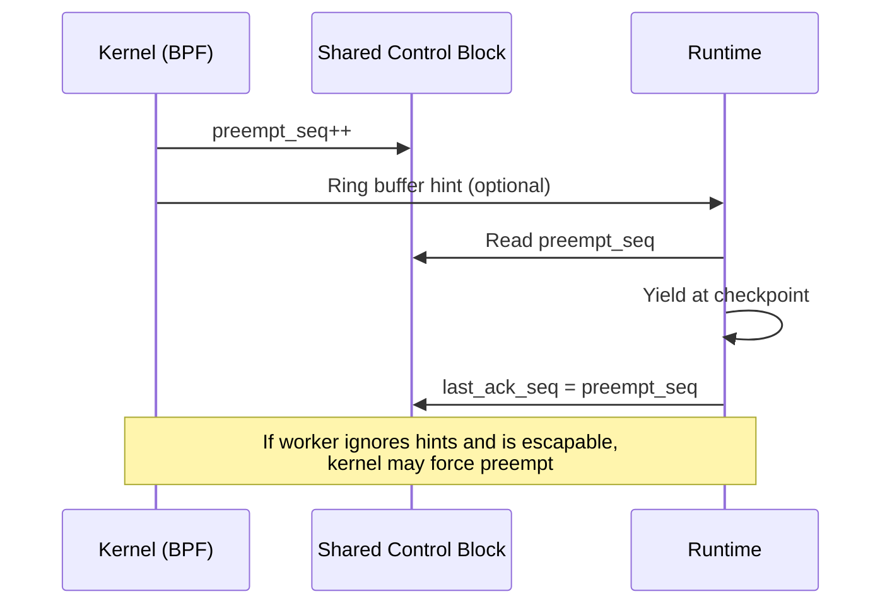

# Morpheus-Hybrid Code Walkthrough

A comprehensive implementation guide for contributors, covering all core components with annotated code examples and explanations of low-level Linux kernel APIs.

---

## Table of Contents

1. [System Overview](#system-overview)
2. [Core Data Structures](#core-data-structures)
3. [BPF Scheduler Deep Dive](#bpf-scheduler-deep-dive)
4. [Runtime Implementation](#runtime-implementation)
5. [Python Bindings](#python-bindings)
6. [Contributing Guide](#contributing-guide)

---

## System Overview

Morpheus-Hybrid implements a **cooperative scheduling protocol** between Linux kernel and userspace runtimes. The kernel *requests* yields, and the runtime *chooses* when to respond.



### Component Map

| Component | Language | Purpose |
|-----------|----------|---------|
| `scx_morpheus` | C (BPF) + Rust | Kernel scheduler and loader |
| `morpheus-common` | Rust + C | Shared types (SCB, hints) |
| `morpheus-runtime` | Rust | Async executor with kernel integration |
| `morpheus-py` | Rust (PyO3) | Python bindings |

---

## Core Data Structures

### Shared Control Block (SCB)

The SCB is the **primary communication channel** between kernel and runtime. Each worker thread owns exactly one SCB, stored in a BPF map and memory-mapped by userspace.

#### Memory Layout (128 bytes, 2 cache lines)

```
┌─────────────────────────────────────────────────────────────┐
│ Cache Line 1 (bytes 0-63): Kernel → Runtime                 │
├─────────────────────────────────────────────────────────────┤
│ preempt_seq (u64)        - Monotonic counter, incremented   │
│                            when kernel wants a yield        │
│ budget_remaining_ns (u64)- Advisory time budget remaining   │
│ kernel_pressure_level    - 0-100 system pressure indicator  │
│ [padding/reserved]                                          │
├─────────────────────────────────────────────────────────────┤
│ Cache Line 2 (bytes 64-127): Runtime → Kernel               │
├─────────────────────────────────────────────────────────────┤
│ is_in_critical_section   - 1 if FFI/GIL code active        │
│ escapable                - 1 if forced preemption allowed   │
│ last_ack_seq             - Last acknowledged preempt_seq    │
│ runtime_priority (u32)   - Advisory priority 0-1000         │
│ [padding/reserved]                                          │
└─────────────────────────────────────────────────────────────┘
```

#### C Definition ([morpheus_shared.h](file:///home/nkit_umar_andey/Morpheus/morpheus-common/include/morpheus_shared.h))

```c
struct morpheus_scb {
    /* Cache Line 1: Kernel → Runtime */
    __u64 preempt_seq;            // Kernel increments to request yield
    __u64 budget_remaining_ns;    // Remaining time budget (advisory)
    __u32 kernel_pressure_level;  // 0-100 pressure indicator
    __u32 _pad0;
    __u64 _reserved0[4];

    /* Cache Line 2: Runtime → Kernel */
    __u32 is_in_critical_section; // 1 = don't escalate
    __u32 escapable;              // 1 = forced preemption allowed
    __u64 last_ack_seq;           // Last acknowledged preempt_seq
    __u32 runtime_priority;       // Advisory priority
    __u32 _pad1;
    __u64 _reserved1[3];
} __attribute__((aligned(64)));

_Static_assert(sizeof(struct morpheus_scb) == 128, "SCB must be 128 bytes");
```

#### Rust Definition ([lib.rs](file:///home/nkit_umar_andey/Morpheus/morpheus-common/src/lib.rs))

```rust
#[repr(C, align(64))]
pub struct MorpheusScb {
    pub preempt_seq: AtomicU64,
    pub budget_remaining_ns: AtomicU64,
    pub kernel_pressure_level: AtomicU32,
    _pad0: u32,
    _reserved0: [u64; 4],
    
    pub is_in_critical_section: AtomicU32,
    pub escapable: AtomicU32,
    pub last_ack_seq: AtomicU64,
    pub runtime_priority: AtomicU32,
    _pad1: u32,
    _reserved1: [u64; 3],
}
```

> [!IMPORTANT]
> Both C and Rust definitions **must** remain in sync. The structure is `#[repr(C)]` to ensure binary compatibility. The `align(64)` ensures each cache line is properly aligned to avoid false sharing.

### Yield Detection Logic

The runtime checks for yield requests with a simple comparison:

```rust
// In scb.rs - ScbHandle::yield_requested()
pub fn yield_requested(&self) -> bool {
    let scb = self.scb();
    let preempt = scb.preempt_seq.load(Ordering::Acquire);
    let acked = scb.last_ack_seq.load(Ordering::Relaxed);
    preempt > acked  // True if kernel has requested a yield
}
```

---

## BPF Scheduler Deep Dive

The BPF scheduler ([scx_morpheus.bpf.c](file:///home/nkit_umar_andey/Morpheus/scx_morpheus/src/bpf/scx_morpheus.bpf.c)) runs inside the Linux kernel and implements the scheduling logic.

### What is sched_ext?

**sched_ext** is a Linux kernel feature (6.12+) that allows loading custom schedulers via BPF without kernel recompilation. Key concepts:

| Concept | Description |
|---------|-------------|
| **BPF** | Berkeley Packet Filter - safe bytecode that runs in kernel |
| **sched_ext** | Extension point for pluggable schedulers |
| **DSQ** | Dispatch Queue - where tasks wait to be scheduled |
| **SCX_OPS** | Structure defining scheduler callbacks |

### BPF Map Definitions

Maps are the primary data structure for kernel↔userspace communication:

```c
// SCB Map - One SCB per worker, mmap'd by userspace
struct {
    __uint(type, BPF_MAP_TYPE_ARRAY);
    __type(key, u32);
    __type(value, struct morpheus_scb);
    __uint(max_entries, MORPHEUS_MAX_WORKERS);  // 1024
    __uint(map_flags, BPF_F_MMAPABLE);  // Allows userspace mmap
} scb_map SEC(".maps");

// Worker TID Map - Maps OS thread ID → worker_id
struct {
    __uint(type, BPF_MAP_TYPE_HASH);
    __type(key, u32);   // pid (actually TID)
    __type(value, u32); // worker_id
    __uint(max_entries, MORPHEUS_MAX_WORKERS);
} worker_tid_map SEC(".maps");

// Hint Ring Buffer - Kernel → Userspace events
struct {
    __uint(type, BPF_MAP_TYPE_RINGBUF);
    __uint(max_entries, MORPHEUS_RINGBUF_SIZE);  // 256KB
} hint_ringbuf SEC(".maps");

// Per-CPU statistics
struct {
    __uint(type, BPF_MAP_TYPE_PERCPU_ARRAY);
    __type(key, u32);
    __type(value, struct morpheus_stats);
    __uint(max_entries, 1);
} stats_map SEC(".maps");
```

> [!NOTE]
> **BPF_F_MMAPABLE**: This flag enables memory-mapping the array into userspace. Without it, userspace would need syscalls (`bpf_map_lookup_elem`) for every SCB access - far too slow for a cooperative scheduler.

### Scheduler Callbacks Explained

sched_ext schedulers implement callbacks that are invoked at scheduling decision points:

#### 1. Initialization

```c
s32 BPF_STRUCT_OPS_SLEEPABLE(morpheus_init)
{
    // Create a dispatch queue with ID 0
    return scx_bpf_create_dsq(MORPHEUS_DSQ_ID, -1);
}
```

**`scx_bpf_create_dsq(dsq_id, cpu)`**: Creates a Dispatch Queue. Tasks are placed on DSQs and consumed by CPUs. `-1` means the DSQ is global (not pinned to a CPU).

#### 2. Task Initialization

```c
s32 BPF_STRUCT_OPS(morpheus_init_task, struct task_struct *p,
                   struct scx_init_task_args *args)
{
    // Allocate per-task storage
    struct task_ctx *tctx = bpf_task_storage_get(&task_ctx_map, p,
                                NULL, BPF_LOCAL_STORAGE_GET_F_CREATE);
    if (!tctx) return -ENOMEM;

    tctx->last_tick_ns = 0;
    tctx->runtime_ns = 0;

    // Check if this task is a registered Morpheus worker
    u32 pid = p->pid;
    u32 *worker_id_ptr = bpf_map_lookup_elem(&worker_tid_map, &pid);
    if (worker_id_ptr) {
        tctx->worker_id = *worker_id_ptr;
        tctx->is_morpheus_worker = true;
    }
    return 0;
}
```

**BPF APIs used**:
- `bpf_task_storage_get()`: Allocates per-task private storage attached to `task_struct`
- `bpf_map_lookup_elem()`: Looks up a value in a BPF map by key

#### 3. CPU Selection

```c
s32 BPF_STRUCT_OPS(morpheus_select_cpu, struct task_struct *p, 
                   s32 prev_cpu, u64 wake_flags)
{
    bool is_idle = false;
    s32 cpu = scx_bpf_select_cpu_dfl(p, prev_cpu, wake_flags, &is_idle);
    
    if (is_idle)
        // Dispatch directly to the idle CPU's local queue
        scx_bpf_dispatch(p, SCX_DSQ_LOCAL, slice_ns, 0);
    
    return cpu;
}
```

**`scx_bpf_select_cpu_dfl()`**: sched_ext's default CPU selection. Prefers the previous CPU if available, otherwise finds an idle CPU.

**`scx_bpf_dispatch(p, dsq, slice, flags)`**: Places task `p` on dispatch queue `dsq` with time slice `slice`.

#### 4. The Tick Handler (Core Logic)

The tick handler runs on every scheduler tick (~1-4ms) and implements the Morpheus protocol:

```c
void BPF_STRUCT_OPS(morpheus_tick, struct task_struct *p)
{
    struct task_ctx *tctx = get_task_ctx(p);
    if (!tctx || !tctx->is_morpheus_worker)
        return;  // Not a Morpheus worker, skip

    // Track runtime
    u64 now = bpf_ktime_get_ns();
    if (tctx->last_tick_ns > 0) {
        tctx->runtime_ns += now - tctx->last_tick_ns;
    }
    tctx->last_tick_ns = now;

    struct morpheus_scb *scb = get_scb(tctx->worker_id);
    if (!scb) return;

    // Check if we exceeded the slice
    if (tctx->runtime_ns > slice_ns) {
        // Request yield by incrementing preempt_seq
        u64 preempt_seq = __sync_add_and_fetch(&scb->preempt_seq, 1);
        
        // Emit hint via ring buffer
        emit_hint(tctx->worker_id, preempt_seq, MORPHEUS_HINT_BUDGET,
                  p->pid, now + grace_period_ns);

        // === Gated Escalation Check ===
        u32 escapable = __sync_load_n(&scb->escapable, __ATOMIC_ACQUIRE);
        u32 is_critical = __sync_load_n(&scb->is_in_critical_section, 
                                         __ATOMIC_ACQUIRE);
        u64 last_ack_seq = __sync_load_n(&scb->last_ack_seq, __ATOMIC_ACQUIRE);

        // Escalation requires ALL conditions:
        // 1. Worker opted in (escapable == 1)
        // 2. Not in critical section
        // 3. Ignored hints (last_ack_seq < preempt_seq)
        // 4. Runtime exceeds grace period
        if (escapable &&
            !is_critical &&
            last_ack_seq < preempt_seq &&
            tctx->runtime_ns > (slice_ns + grace_period_ns)) {
            
            // Force preemption
            scx_bpf_kick_cpu(scx_bpf_task_cpu(p), SCX_KICK_PREEMPT);
        }
    }
}
```

**Key BPF APIs**:

| API | Purpose |
|-----|---------|
| `bpf_ktime_get_ns()` | Returns monotonic nanosecond timestamp |
| `__sync_add_and_fetch()` | GCC atomic add-and-fetch builtin |
| `__sync_load_n()` | GCC atomic load with memory ordering |
| `bpf_ringbuf_reserve()` | Reserve space in ring buffer |
| `bpf_ringbuf_submit()` | Submit reserved ring buffer entry |
| `scx_bpf_kick_cpu()` | Force a scheduling decision on a CPU |

> [!CAUTION]
> **Escalation Safety**: The kernel will **never** force-preempt a worker that has `escapable=0` or `is_in_critical_section=1`. This is critical for Python (GIL) and FFI safety.

### Loading the BPF Scheduler

The Rust loader ([main.rs](file:///home/nkit_umar_andey/Morpheus/scx_morpheus/src/main.rs)) uses `libbpf-rs` with the skeleton pattern:

```rust
// Build skeleton from compiled BPF object
let skel_builder = ScxMorpheusSkelBuilder::default();
let mut open_skel = skel_builder.open()?;

// Set configuration BEFORE loading (read-only data section)
open_skel.rodata_mut().slice_ns = args.slice_ms * 1_000_000;
open_skel.rodata_mut().grace_period_ns = args.grace_ms * 1_000_000;

// Load BPF programs into kernel
let mut skel = open_skel.load()?;

// Attach sched_ext operations
skel.attach()?;
```

The skeleton is auto-generated at build time by `libbpf-cargo` from the BPF object file.

---

## Runtime Implementation

### SCB Memory Mapping

Userspace accesses SCBs via `mmap()` for zero-copy performance ([scb.rs](file:///home/nkit_umar_andey/Morpheus/morpheus-runtime/src/scb.rs)):

```rust
pub unsafe fn new(map_fd: BorrowedFd<'_>, worker_id: u32, 
                  escapable: bool) -> Result<Self> {
    // Calculate offset into the SCB array
    let scb_size = std::mem::size_of::<MorpheusScb>();  // 128 bytes
    let offset = (worker_id as usize) * scb_size;

    // Duplicate the fd (map_fd is owned by libbpf)
    let dup_fd = libc::dup(map_fd.as_raw_fd());
    let file = File::from_raw_fd(dup_fd);

    // Memory-map the SCB
    let mmap = memmap2::MmapOptions::new()
        .offset(offset as u64)
        .len(scb_size)
        .map_mut(&file)?;

    // Initialize the SCB fields
    let scb = &*ptr.as_ptr();
    scb.preempt_seq.store(0, Ordering::Release);
    scb.escapable.store(if escapable { 1 } else { 0 }, Ordering::Release);
    scb.last_ack_seq.store(0, Ordering::Release);
    // ...
}
```

> [!TIP]
> The `BPF_F_MMAPABLE` flag on the BPF map enables this zero-copy access. Each `mmap()` call creates a virtual memory mapping directly to the kernel's map storage.

### Critical Section Guards

Critical sections protect FFI and GIL-sensitive code ([critical.rs](file:///home/nkit_umar_andey/Morpheus/morpheus-runtime/src/critical.rs)):

```rust
pub struct CriticalGuard {
    // !Send and !Sync to prevent holding across await points
    _marker: PhantomData<*const ()>,
    _depth: u32,
}

thread_local! {
    static CRITICAL_DEPTH: Cell<u32> = const { Cell::new(0) };
}

pub fn critical_section() -> CriticalGuard {
    CRITICAL_DEPTH.with(|depth| {
        let current = depth.get();
        depth.set(current + 1);

        // Only set SCB flag on first entry (nesting support)
        if current == 0 {
            if let Some(scb) = worker::try_current_scb() {
                scb.enter_critical();  // Sets is_in_critical_section = 1
            }
        }

        CriticalGuard { _marker: PhantomData, _depth: current + 1 }
    })
}

impl Drop for CriticalGuard {
    fn drop(&mut self) {
        CRITICAL_DEPTH.with(|depth| {
            let current = depth.get();
            depth.set(current - 1);
            
            // Only clear SCB flag on last exit
            if current == 1 {
                if let Some(scb) = worker::try_current_scb() {
                    scb.exit_critical();  // Sets is_in_critical_section = 0
                }
            }
        });
    }
}
```

**Why `!Send` and `!Sync`?** If a `CriticalGuard` could be held across an await point, the task might move to a different worker thread, leaving the critical section flag incorrectly set on the original thread.

### The Checkpoint Macro

The `checkpoint!()` macro is the primary yield coordination point ([lib.rs](file:///home/nkit_umar_andey/Morpheus/morpheus-runtime/src/lib.rs)):

```rust
#[macro_export]
macro_rules! checkpoint {
    () => {{
        if let Some(scb_handle) = $crate::worker::try_current_scb() {
            if scb_handle.yield_requested() {
                $crate::executor::yield_now().await;
            }
        }
    }};
}
```

The `yield_now()` function is a minimal async yield:

```rust
pub async fn yield_now() {
    YieldNow { yielded: false }.await
}

struct YieldNow { yielded: bool }

impl Future for YieldNow {
    type Output = ();

    fn poll(mut self: Pin<&mut Self>, cx: &mut Context<'_>) -> Poll<()> {
        if self.yielded {
            Poll::Ready(())
        } else {
            self.yielded = true;
            cx.waker().wake_by_ref();  // Re-schedule immediately
            Poll::Pending              // But yield first
        }
    }
}
```

### Work-Stealing Executor

The executor uses crossbeam's work-stealing deques ([executor.rs](file:///home/nkit_umar_andey/Morpheus/morpheus-runtime/src/executor.rs)):

```rust
pub struct LocalExecutor {
    queue: WorkQueue<Runnable>,           // Local FIFO queue
    injector: Arc<Injector<Runnable>>,    // Global queue for cross-thread spawns
    stealers: Vec<Stealer<Runnable>>,     // Steal from other workers
    defensive: Arc<DefensiveMode>,         // Ring buffer overflow handling
}

pub fn tick(&self) -> bool {
    // 1. Try local queue first
    if let Some(runnable) = self.queue.pop() {
        self.run_task(runnable);
        return true;
    }

    // 2. Try global injector
    if let Some(runnable) = self.injector.steal().success() {
        self.run_task(runnable);
        return true;
    }

    // 3. Steal from other workers
    for stealer in &self.stealers {
        if let Some(runnable) = stealer.steal().success() {
            self.run_task(runnable);
            return true;
        }
    }
    
    false
}

fn run_task(&self, runnable: Runnable) {
    // Check for kernel yield BEFORE polling
    if self.should_yield() {
        self.queue.push(runnable);  // Re-queue
        self.acknowledge_yield();
        return;
    }
    
    runnable.run();  // Execute the task
}
```

### Ring Buffer Consumer

The ring buffer handles kernel hints asynchronously ([ringbuf.rs](file:///home/nkit_umar_andey/Morpheus/morpheus-runtime/src/ringbuf.rs)):

```rust
pub struct HintConsumer {
    last_seq: AtomicU64,                  // For gap detection
    defensive_mode: Arc<AtomicBool>,      // Shared with workers
    stats: Arc<RingBufStats>,
}

pub fn process_hint(&self, data: &[u8]) -> i32 {
    let hint = unsafe { 
        std::ptr::read_unaligned(data.as_ptr() as *const MorpheusHint) 
    };
    
    // Detect dropped hints via sequence gaps
    let last = self.last_seq.load(Ordering::Relaxed);
    if hint.seq > last + 1 && last > 0 {
        let dropped = hint.seq - last - 1;
        self.stats.hints_dropped.fetch_add(dropped, Ordering::Relaxed);
        
        // Trigger defensive mode
        if !self.defensive_mode.swap(true, Ordering::Release) {
            warn!("entering defensive mode due to hint drops");
        }
    }
    
    self.last_seq.store(hint.seq, Ordering::Relaxed);
    0  // Continue consuming
}
```

**Defensive Mode**: When hints are dropped (ring buffer overflow), the runtime enters "defensive mode" and yields more aggressively to recover.

---

## Python Bindings

The Python module ([lib.rs](file:///home/nkit_umar_andey/Morpheus/morpheus-py/src/lib.rs)) uses PyO3 to expose Rust functions:

```rust
use pyo3::prelude::*;

#[pyfunction]
fn checkpoint() -> bool {
    rt::checkpoint_sync()  // Same as Rust checkpoint
}

// Context manager for critical sections
#[pyclass]
struct CriticalSection { active: bool }

#[pymethods]
impl CriticalSection {
    #[new]
    fn new() -> Self { Self { active: false } }

    fn __enter__(&mut self) -> PyResult<()> {
        enter_critical_section();
        self.active = true;
        Ok(())
    }

    fn __exit__(&mut self, _: Option<&Bound<'_, PyAny>>, 
                _: Option<&Bound<'_, PyAny>>,
                _: Option<&Bound<'_, PyAny>>) -> PyResult<bool> {
        if self.active {
            exit_critical_section();
            self.active = false;
        }
        Ok(false)  // Don't suppress exceptions
    }
}

#[pyfunction]
fn critical() -> CriticalSection {
    CriticalSection::new()
}

#[pymodule]
fn morpheus(m: &Bound<'_, PyModule>) -> PyResult<()> {
    m.add_function(wrap_pyfunction!(checkpoint, m)?)?;
    m.add_function(wrap_pyfunction!(critical, m)?)?;
    m.add_class::<CriticalSection>()?;
    // ... more bindings ...
    Ok(())
}
```

**Python Usage**:

```python
import morpheus
import asyncio

async def heavy_computation():
    for i in range(1_000_000):
        # ... compute ...
        if i % 1000 == 0:
            if morpheus.checkpoint():
                await asyncio.sleep(0)  # Yield to event loop

async def ffi_work():
    with morpheus.critical():
        # Kernel will not force-preempt here
        ctypes.cdll.LoadLibrary("mylib.so").blocking_call()
```

> [!IMPORTANT]
> **Python Default: `escapable=false`**. Python workers cannot be force-preempted because the GIL prevents safe preemption during C extension calls.

---

## Contributing Guide

### Building

```bash
# Install dependencies (Ubuntu/Debian)
sudo apt install clang llvm libelf-dev linux-headers-$(uname -r)

# Build Rust components
cargo build --release

# Build Python wheel
cd morpheus-py && maturin build --release
```

### Key Files to Understand

| File | Purpose |
|------|---------|
| `morpheus-common/include/morpheus_shared.h` | Binary contract between kernel and userspace |
| `scx_morpheus/src/bpf/scx_morpheus.bpf.c` | BPF scheduler logic |
| `morpheus-runtime/src/scb.rs` | SCB memory mapping |
| `morpheus-runtime/src/critical.rs` | Critical section RAII guards |
| `morpheus-runtime/src/executor.rs` | Work-stealing async executor |

### Testing

```bash
# Unit tests
cargo test

# Integration test (requires root + kernel 6.12+)
sudo cargo test --features integration

# Benchmarks
cargo bench
```

### Common Pitfalls

1. **SCB alignment**: Both C and Rust definitions must be 128 bytes, 64-byte aligned
2. **Atomic ordering**: Use `Acquire`/`Release` for cross-boundary synchronization
3. **Critical section nesting**: Always use RAII guards, never manual enter/exit
4. **Python GIL**: Never set `escapable=true` in Python workers
