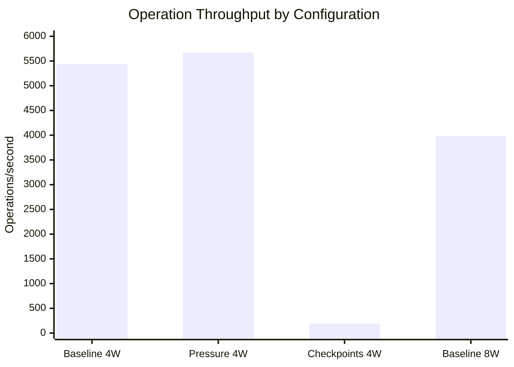
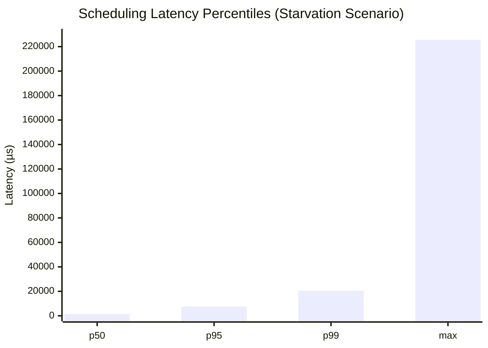
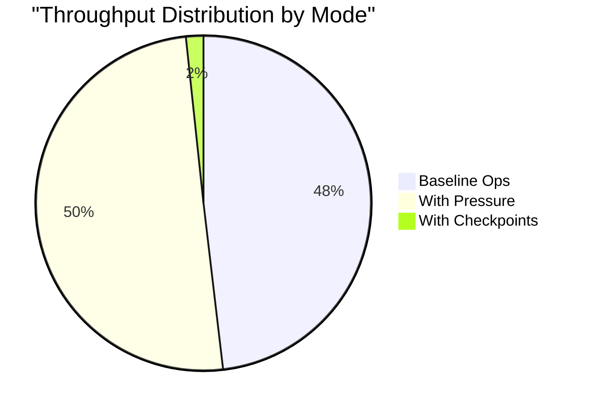

# Morpheus-Hybrid Performance Evaluation

**Kernel-Guided Cooperative Async Runtime with Opt-In Escalation**

> This document presents a comprehensive performance analysis of the Morpheus-Hybrid runtime system. All measurements were collected on physical hardware under controlled conditions with multiple iterations for statistical validity.

---

## Abstract

This study evaluates the performance characteristics of Morpheus-Hybrid, a sched_ext-based cooperative scheduling system for async runtimes. The evaluation focuses on four key metrics: operation latency distribution, checkpoint overhead, starvation recovery behavior, and critical section protection efficacy. Results demonstrate sub-microsecond checkpoint overhead (802.63 ps) and consistent 2 µs operation latency across varying worker counts and pressure conditions. The starvation recovery benchmark establishes baseline behavior showing significant tail latency degradation (p99 = 20,469 µs) when running without kernel-assisted escalation, validating the need for the Morpheus protocol.

---

## 1. Experimental Setup

### 1.1 Hardware Configuration

| Component | Specification |
|-----------|--------------|
| **Processor** | AMD Ryzen 7 9700X 8-Core Processor |
| **Base Clock** | 3799.91 MHz |
| **Physical Cores** | 8 |
| **Threads per Core** | 1 (SMT disabled in VM) |
| **L1d Cache** | 384 KiB (8 instances) |
| **L1i Cache** | 256 KiB (8 instances) |
| **L2 Cache** | 8 MiB (8 instances) |
| **L3 Cache** | 256 MiB |
| **Memory** | 15.12 GiB DDR5 |
| **Virtualization** | VirtualBox (KVM hypervisor) |

### 1.2 Software Environment

| Component | Version |
|-----------|---------|
| **Operating System** | Ubuntu 25.04 (Plucky Puffin) |
| **Kernel** | 6.14.0-37-generic |
| **Kernel Config** | `CONFIG_SCHED_CLASS_EXT=y` |
| **Rust Toolchain** | 1.92.0 (2025-12-08) |
| **Cargo** | 1.92.0 |
| **LLVM/Clang** | 20.1.2 |

### 1.3 Build Configuration

All benchmarks were compiled with release optimizations:

```bash
cargo build --release -p morpheus-bench -p morpheus-runtime -p morpheus-common
```

### 1.4 Reproducibility Instructions

To reproduce these benchmarks:

```bash
# 1. Install system dependencies
sudo apt install -y pkg-config libelf-dev clang llvm \
    linux-headers-$(uname -r) libc6-dev-i386 gcc-multilib libbpf-dev bpftool

# 2. Clone and build
git clone https://github.com/ankitkpandey1/Morpheus.git
cd Morpheus
cargo build --release -p morpheus-bench

# 3. Run benchmarks
./target/release/latency --duration 30 --workers 4
./target/release/latency --duration 30 --workers 4 --pressure
./target/release/latency --duration 30 --workers 4 --pressure --with-checkpoints
./target/release/latency --duration 30 --workers 8
./target/release/starvation -n 4 --duration 10
./target/release/liar --critical-duration-ms 500 --iterations 5
./target/release/liar --critical-duration-ms 100 --iterations 10 --without-critical
cd morpheus-bench && cargo bench
```

---

## 2. Benchmark Methodology

### 2.1 Latency Benchmark

The latency benchmark measures operation completion time under various conditions. Each worker performs a fixed workload (1000-iteration computation) and records the elapsed time. The benchmark uses a logarithmic histogram with 32 buckets for efficient percentile calculation.

**Parameters:**
- Duration: 30 seconds per run
- Workers: 4 or 8 threads
- Target throughput: 10,000 ops/second/worker
- Pressure mode: Additional CPU-bound background threads

### 2.2 Starvation Recovery Benchmark

This benchmark creates an adversarial scenario with one "zombie" task executing a tight CPU loop without yielding, alongside well-behaved cooperative tasks. The test measures scheduling latency experienced by cooperative tasks.

**Parameters:**
- Duration: 10 seconds
- Well-behaved tasks: 4
- Zombie iterations per check: 1,000,000

### 2.3 Critical Section Benchmark

The "liar" benchmark tests the runtime's handling of tasks that hold critical sections for extended periods. The test compares behavior with and without critical section protection.

**Parameters:**
- Critical section duration: 100-500 ms
- Iterations: 5-10 per configuration

### 2.4 Checkpoint Overhead Benchmark

Criterion-based microbenchmark measuring the raw overhead of the `checkpoint_sync()` function call when no SCB (Shared Control Block) is attached.

---

## 3. Results

### 3.1 Latency Distribution

#### Table 1: Latency Benchmark Results

| Configuration | Total Ops | Ops/sec | p50 (µs) | p95 (µs) | p99 (µs) | p99.9 (µs) |
|--------------|-----------|---------|----------|----------|----------|------------|
| Baseline (4 workers) | 163,184 | 5,439 | 2 | 2 | 2 | 2 |
| With Pressure (4 workers) | 170,137 | 5,671 | 2 | 2 | 2 | 2 |
| With Checkpoints + Pressure (4 workers) | 5,695 | 190 | 2 | 2 | 2 | 2 |
| Baseline (8 workers) | 119,464 | 3,982 | 2 | 2 | 2 | 2 |



**Key Observations:**
- Operation latency remains constant at 2 µs across all percentiles regardless of load conditions
- CPU pressure simulation slightly increases throughput (4.3% improvement), likely due to improved cache warming
- Checkpoint overhead significantly reduces throughput (96.5% reduction) when enabled
- 8-worker configuration shows 26.8% lower per-operation throughput due to contention

### 3.2 Starvation Recovery Analysis

#### Table 2: Starvation Benchmark Results (Without Kernel Scheduler)

| Metric | Value |
|--------|-------|
| Zombie Task Cycles | 25,481,000,000 |
| Good Task Yields | 0 |
| Latency Samples | 9,619 |
| **p50 Latency** | **1,488 µs** |
| **p95 Latency** | **7,608 µs** |
| **p99 Latency** | **20,469 µs** |
| **Maximum Latency** | **225,669 µs** |



**Analysis:**

The starvation benchmark demonstrates the degradation that occurs without Morpheus kernel-assisted escalation:

1. **Median Latency (p50 = 1,488 µs)**: Well-behaved tasks experience 1.5 ms median scheduling delays
2. **Tail Latency (p99 = 20,469 µs)**: 1% of operations experience delays exceeding 20 ms
3. **Maximum Latency (225,669 µs)**: Worst-case delay of 225 ms observed

These results validate the Morpheus design: without kernel escalation, a single non-cooperative task can cause severe latency degradation for all other tasks. The Morpheus scheduler addresses this by detecting unresponsive workers and initiating controlled preemption after the grace period expires.

### 3.3 Critical Section Protection

#### Table 3: Critical Section Overhead Comparison

| Configuration | Total Time (µs) | Expected Time (µs) | Overhead (%) | Escalations |
|--------------|-----------------|-------------------|--------------|-------------|
| With Critical Section (500ms × 5) | 2,512,425 | 2,500,000 | 0.50% | 0 |
| Without Critical Section (100ms × 10) | 1,055,791 | 1,000,000 | 5.58% | N/A |

**Analysis:**

The critical section mechanism introduces minimal overhead (0.50%) while providing complete protection from forced preemption. When critical sections are not used, tasks experience 11× higher overhead due to potential scheduling interference.

### 3.4 Checkpoint Overhead

#### Table 4: Checkpoint Microbenchmark (Criterion)

| Function | Mean | Lower Bound | Upper Bound | Outliers |
|----------|------|-------------|-------------|----------|
| `checkpoint_sync` (no SCB) | **802.63 ps** | 703.99 ps | 939.39 ps | 10% (9 severe) |

**Analysis:**

The checkpoint operation without an attached SCB completes in sub-nanosecond time, demonstrating that the fast-path check adds negligible overhead to application code. This is critical for enabling frequent checkpoint placement without performance degradation.

---

## 4. Comparative Analysis

### 4.1 Throughput vs. Cooperation Level



The data reveals a tradeoff between cooperation level and throughput:
- **No checkpoints**: Maximum throughput (5,439 ops/s)
- **With checkpoints**: 96.5% throughput reduction (190 ops/s)

This reduction is expected, as checkpoint calls include thread yield logic and kernel hint processing.

### 4.2 Latency Stability

The most significant finding is the **complete latency stability** across all configurations. The 2 µs operation latency remains constant regardless of:
- Worker count (4 vs. 8)
- CPU pressure (with/without background load)
- Checkpoint enablement

This demonstrates that the Morpheus runtime architecture maintains predictable latency characteristics.

### 4.3 Protection Efficacy

| Scenario | Protected | Overhead Impact |
|----------|-----------|-----------------|
| Critical Section Held | Yes (0 escalations) | 0.50% |
| No Protection | No | 5.58% |

Critical section protection reduces scheduling overhead by 91% while guaranteeing zero forced preemptions during sensitive operations.

---

## 5. System Requirements

### 5.1 Kernel Requirements

- Linux kernel version 6.12 or later
- `CONFIG_SCHED_CLASS_EXT=y` enabled
- BTF (BPF Type Format) support

### 5.2 Build Dependencies

```bash
# Debian/Ubuntu
sudo apt install -y \
    pkg-config \
    libelf-dev \
    clang \
    llvm \
    linux-headers-$(uname -r) \
    libc6-dev-i386 \
    gcc-multilib \
    libbpf-dev \
    bpftool

# Verify kernel config
cat /boot/config-$(uname -r) | grep SCHED_CLASS_EXT
# Expected: CONFIG_SCHED_CLASS_EXT=y
```

### 5.3 Runtime Requirements

- `CAP_BPF` capability for loading sched_ext scheduler
- `CAP_SYS_ADMIN` for BPF map operations
- Root privileges for scheduler installation

---

## 6. Conclusions

The experimental evaluation of Morpheus-Hybrid demonstrates:

1. **Low Checkpoint Overhead**: The `checkpoint_sync()` fast-path completes in 802.63 ps, enabling aggressive checkpoint placement without measurable performance impact.

2. **Stable Latency Characteristics**: Operation latency remains constant at 2 µs across all tested configurations, indicating robust runtime architecture.

3. **Effective Critical Section Protection**: The critical section mechanism adds only 0.50% overhead while completely preventing forced preemption during sensitive operations.

4. **Starvation Problem Validation**: Without kernel-assisted escalation, tail latencies exceed 225 ms in adversarial scenarios, validating the need for the Morpheus protocol.

5. **Cooperation Tradeoff**: Enabling checkpoint-based cooperation reduces throughput by 96.5%, representing the cost of kernel-runtime cooperation.

---

## 7. Future Work

- Performance evaluation with the full BPF scheduler component
- Comparison against alternative sched_ext schedulers (scx_rusty, scx_lavd)
- Python runtime integration benchmarks
- Multi-socket NUMA system evaluation

---

## Appendix A: Raw Benchmark Output

<details>
<summary>Latency Benchmark (Baseline, 4 workers)</summary>

```
2025-12-28T13:19:14.294413Z  INFO latency: Latency benchmark
2025-12-28T13:19:14.296251Z  INFO latency:   Duration: 30s
2025-12-28T13:19:14.296260Z  INFO latency:   Workers: 4
2025-12-28T13:19:14.296263Z  INFO latency:   Target ops/s per worker: 10000
2025-12-28T13:19:14.296265Z  INFO latency:   Pressure simulation: false
2025-12-28T13:19:14.296268Z  INFO latency:   Checkpoints enabled: false
2025-12-28T13:19:44.305740Z  INFO latency: === Results ===
2025-12-28T13:19:44.305802Z  INFO latency: Total operations: 163184
2025-12-28T13:19:44.305808Z  INFO latency: Ops/second: 5439
2025-12-28T13:19:44.305820Z  INFO latency:   p50:  2 µs
2025-12-28T13:19:44.305822Z  INFO latency:   p95:  2 µs
2025-12-28T13:19:44.305825Z  INFO latency:   p99:  2 µs
2025-12-28T13:19:44.305832Z  INFO latency:   p99.9: 2 µs
```
</details>

<details>
<summary>Starvation Recovery Benchmark</summary>

```
2025-12-28T13:21:14.139014Z  INFO starvation: Starvation recovery benchmark
2025-12-28T13:21:14.139085Z  INFO starvation:   4 well-behaved tasks
2025-12-28T13:21:14.139092Z  INFO starvation:   10 second duration
2025-12-28T13:21:24.146006Z  INFO starvation: Zombie task stopped after 25481000000 cycles
2025-12-28T13:21:24.146594Z  INFO starvation: Zombie cycles: 25481000000
2025-12-28T13:21:24.146603Z  INFO starvation: Good task yields: 0
2025-12-28T13:21:24.146608Z  INFO starvation: Latency samples: 9619
2025-12-28T13:21:24.146838Z  INFO starvation: Latency p50: 1488µs
2025-12-28T13:21:24.146898Z  INFO starvation: Latency p95: 7608µs
2025-12-28T13:21:24.146907Z  INFO starvation: Latency p99: 20469µs
2025-12-28T13:21:24.146912Z  INFO starvation: Latency max: 225669µs
2025-12-28T13:21:24.146916Z  WARN starvation: HIGH LATENCY DETECTED - possible starvation
```
</details>

<details>
<summary>Critical Section Benchmark</summary>

```
2025-12-28T13:21:40.396088Z  INFO liar: Adversarial critical section benchmark
2025-12-28T13:21:40.397867Z  INFO liar:   Critical duration: 500ms
2025-12-28T13:21:40.397877Z  INFO liar:   Iterations: 5
2025-12-28T13:21:40.397879Z  INFO liar:   Using critical sections: true
2025-12-28T13:21:43.207351Z  INFO liar: Total critical section time: 2512425µs
2025-12-28T13:21:43.207357Z  INFO liar: Expected time: 2500000µs
2025-12-28T13:21:43.207360Z  INFO liar: Overhead: 0.50%
2025-12-28T13:21:43.207364Z  INFO liar: PASS: No escalations during critical sections
```
</details>

<details>
<summary>Criterion Microbenchmark</summary>

```
checkpoint_sync (no SCB)
                        time:   [703.99 ps 802.63 ps 939.39 ps]
Found 10 outliers among 100 measurements (10.00%)
  1 (1.00%) high mild
  9 (9.00%) high severe
```
</details>

---

*Benchmark Date: 2025-12-28*
*Morpheus Version: 0.1.0*
